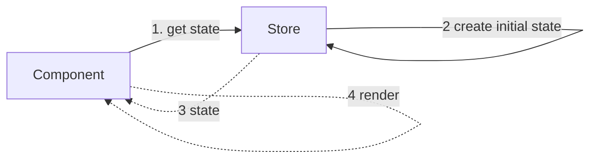
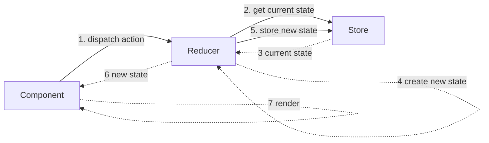
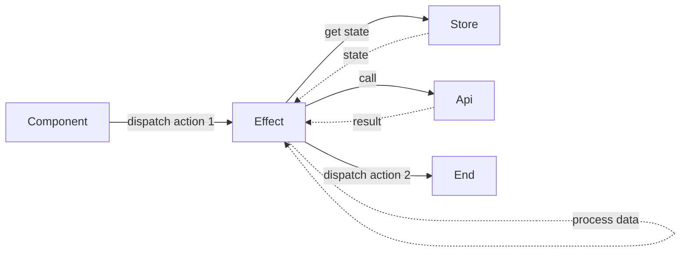
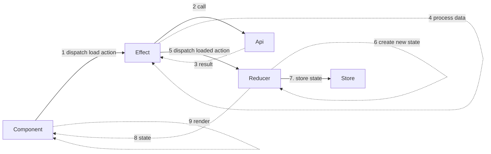

# Flux / redux explained with diagrams
Diagrams are simplified to be more readable.

## 1. Component first load
The first time a component is rendered, it needs a state. The Store is responsible to instanciate and store the initial state.

## 2. Reducer
A reducer create a new state from the action and the current state.

## 3. Effect
An effect can execute code that have "side effects" like calling an api.

## 4. Effect then Reducer
This example illustrates how effect and reducer collaborate to load data in a state rendered in a component.

