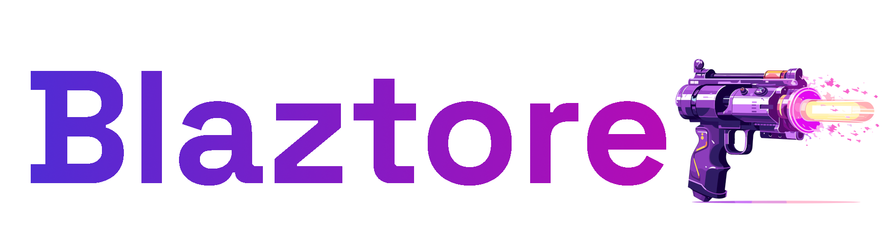

# Blaztore

[](https://github.com/pierregillon/Blaztore/actions/workflows/dotnet.yml)
[&url=https://raw.githubusercontent.com/pierregillon/Blaztore/main/src/Blaztore/Blaztore.csproj)](https://www.nuget.org/packages/Blaztore)
[](https://www.nuget.org/packages/Blaztore)



A simple and modest library to implement **Flux/Redux** pattern in **[.NET Blazor](https://dotnet.microsoft.com/en-us/apps/aspnet/web-apps/blazor)**.

## Introduction

If you are not familiar with the Flux/Redux model, have a look on the following nice resources:
- [ReduxJs](https://redux.js.org/tutorials/essentials/part-1-overview-concepts)

You can find diagrams [**here**](docs/diagrams.md) to help you understand.

## Goal 🎯

Blazor does not contain a native Flux/Redux or MVU api internally.

The objective of this library is to provide a very **simple and minimalist** api to implement a Flux/Redux architecture.

This repository is largely inspired by the following existing repositories:
- [blazor-state](https://github.com/TimeWarpEngineering/blazor-state)
- [Fluxor](https://github.com/mrpmorris/Fluxor/tree/master)

If you are not satisfied by this library, don't hesitate to check them out, they are great.

## Advantages 💪

Compared to the listed existing libraries, Blaztore has the following advantages:
- ✅ Focused on **immutability** for every concepts (State, Action, ...)
- ✅ Never force you to inherit from a **base class or a base record**. Every concepts are based on interfaces. It allows you to structure your code as you like (multiple handling, file structure, ...)
- ✅ Use the underlying [MediatR](https://github.com/jbogard/MediatR) library to dispatch actions. 
It is highly extendable and allows you to easily implement **pipeline** or **preprocessing** to add loggers, retry pattern, ...
- ✅ Use the **Flux/Redux** terminology and not a custom one.
- ✅ Enable to store **multiple instances** of the same state type, identified by a unique id.

## Installation 💻

You can download the latest release NuGet packages from the official Blaztor nuget pages.

- [Blaztore](https://www.nuget.org/packages/Blaztore) &url=https://raw.githubusercontent.com/pierregillon/Blaztore/main/src/Blaztore/Blaztore.csproj)

## Getting started 🏁

You can find below examples to illustrate how to implement concepts with **Blazstore**.

### Declare your state
A state represents the data of a particular component.
In .NET **record** is largely recommended for state immutability.

```csharp
public record TaskCreationState(bool IsAddingTask, string? NewTaskDescription) : IGlobalState
{
    // Mandatory static factory method to create the initial state.
    public static TaskCreationState Initialize() => new(false, null);
}
```
### Declare your actions
Actions are messages that can represent a **command** to mutate the system or an **event** that happened in the system.
You must implement `IAction<TState>` to explicitly define for which state is this action.

```csharp
public record StartAddingNewTask : IAction<TaskCreationState>;

public record DefineNewDescription(string NewDescription) : IAction<TaskCreationState>;

public record TaskListLoaded(IReadOnlyCollection<TaskListItem> Payload) : IAction<TaskListState>;
```

### Get state reference and dispatch actions from a component
A base component `BlaztoreComponentBase<TState>` is provided to easily access the `Dispatch(IAction<TState> action)` and `GetState<TState>()` method.
```html
@inherits BlaztoreComponentBase<TaskCreationState>
```
```csharp
@code {

    private TaskCreationState State => GetState<TaskCreationState>();

    protected override Task OnAfterInitialRenderAsync() =>
        Dispatch(new TaskCreationState.Load());
}
```
Use the `State` to render you html elements :
```html
<input value="@State.NewTaskDescription" ... />
```
Use `Dispatch()` to execute an action.
```html
<button onclick="@(() => Dispatch(new StartAddingNewTask()))">
    New task
</button>
```
### Handle your actions with reducers

A pure Reducer is a function that execute an action on a state, returning a new state.
Theoretically, it should not have any dependencies and generates no side effects.

```csharp
public record StartAddingNewTaskReducer(IStore Store) 
    : IPureReducer<TaskCreationState, StartAddingNewTask>
{
    public TaskCreationState Reduce(TaskCreationState state, StartAddingNewTask action) =>
        state with
        {
            IsAddingTask = true
        };
}
```

You can organize you reducers as you prefer: a reducer *for each* action or a *single* reducer for all your actions.

```csharp
public record TaskCreationStateReducer(IStore Store) 
    : IPureReducer<TaskCreationState, StartAddingNewTask>,
      IPureReducer<TaskCreationState, EndAddingNewTask>
{
    public TaskCreationState Reduce(TaskCreationState state, StartAddingNewTask action) =>
        state with
        {
            IsAddingTask = true
        };
        
    public TaskCreationState Reduce(TaskCreationState state, EndAddingNewTask action) =>
        state with
        {
            NewTaskDescription = null,
            IsAddingTask = false
        };
}
```


### Handle your actions with effects

An Effect allows you to execute **side effects** on external system and dispatching new actions.

```csharp
public record ExecuteTaskCreationEffect(
    IStore Store, 
    ITodoListApi Api, 
    IActionDispatcher ActionDispatcher
) : IEffect<TaskCreationState, ExecuteTaskCreation>
{
    public async Task Effect(TaskCreationState state, ExecuteTaskCreation action)
    {
        if (string.IsNullOrWhiteSpace(state.NewTaskDescription))
        {
            return;
        }

        await Api.CreateTask(Guid.NewGuid(), state.NewTaskDescription);
        await ActionDispatcher.Dispatch(new EndAddingNewTask());
        await ActionDispatcher.Dispatch(new TodoListState.Load());
    }
}
```
To see full examples go [here](src/Blaztore.Examples.Wasm/Pages/TodoList/Components/TodoListComponentState.cs) or
[here](src/Blaztore.Examples.Wasm/Pages/TodoList/Components/TaskCreationComponentState.cs).

### Communicate between states with events

To avoid coupling between states, you can use events to communicate.

In the example above, the `TodoListState.Load()` action is dispatched by the `TaskCreationState.ExecuteTaskCreation` effect, creating coupling between the two states.

If 10 others states need to be updated, you are forced to dispatch 10 load states in this effect.

To avoid this, you can create an event and dispatch it from the effect :

```csharp
public record TaskCreated(string Description) : IEvent;

public record ExecuteTaskCreationEffect(...) : IEffect<TaskCreationState, ExecuteTaskCreation>
{
    public async Task Effect(TaskCreationState state, ExecuteTaskCreation action)
    {
        if (string.IsNullOrWhiteSpace(state.NewTaskDescription))
        {
            return;
        }

        await Api.CreateTask(Guid.NewGuid(), state.NewTaskDescription);
        await ActionDispatcher.Dispatch(new EndAddingNewTask());
        
        // Dispatch the event
        await EventPublisher.Publish(new TaskCreated(state.NewTaskDescription));
    }
}
```

Then, you can subscribe to the event and reload the state `TodoListState` :

```csharp
public class ReloadOnTaskCreated(IActionDispatcher actionDispatcher) : IEventListener<TaskCreated>
{
    public async Task On(TaskCreated @event) =>
        await actionDispatcher.Dispatch(new Load());
}
```

In that was, you decouple states.

## Full examples

You can find an example app in Blazor Wasm with Blaztor implementation [here](/src/Blaztore.Examples.Wasm).

## Advanced use cases

### State access scope
You have 3 interfaces to determine the scope of your states:
- `IGlobalState`: a state globally instanciated (singleton). The **same instance** is used for all components requiring it.
- `IScopedState<TScope>`: a state locally instanciated, depending on an explicit scope. Components using **the same scope shares the same state instance**, different scopes, different state instance.
- `IComponentState`: a state that is transient to a component, that means unique per component. All components have a different instance of the state.

### State lifecycle
By default, a state is destroyed **once all components are destroyed**. If you want a state to stay alive you can implement `IPersistentLifecycleState`.

### State instanciation
By default, state are instanciated once the first component requires it. If an action is executed but no state have been created yet, the action is ignored.
If you want to allow your actions to instanciate a default state, you can make your state implement `IStateInstanciableFromActionExecution`.

## Release notes

### v3.0 : .NET 9.0 support
- migrate all projects to .NET 9.0

### v2.0: rework api
- refactor: rename `StateComponent` to `BlaztoreComponentBase` (remove the StateComponent concept)
- feat: introducing a redux gateway for each state access scopes (`IGlobalStateReduxGateway<TGlobalState>`, `IScopedStateReduxGateway<TScopedState>`, `IComponentSTateReduxGateway<TComponentState>`).
It allows to have their own method signature to ensure to not forget scope parameter.
- feat: add `OnParametersChangedAfterComponentRendered()` virtual method on `ExtendedComponentBase`
- fix: issues on `OnParametersChangedAsync()`
- feat: better lifecycle management for states

### v1.1.3: minor fixes
- fix: missing dependency injection configuration for IActionEventDispatcher
- fix: IEffect was retrieving wrong state (not scoped when action was scoped)

### v1.1.n: minor fixes
- doc: add readme and assets

### v1: initial version